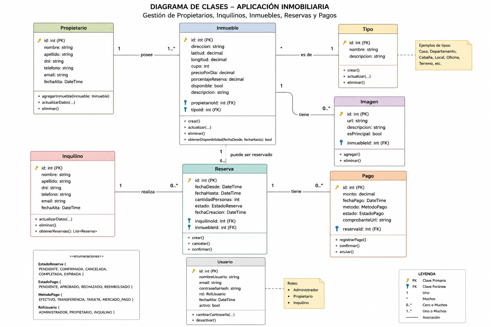
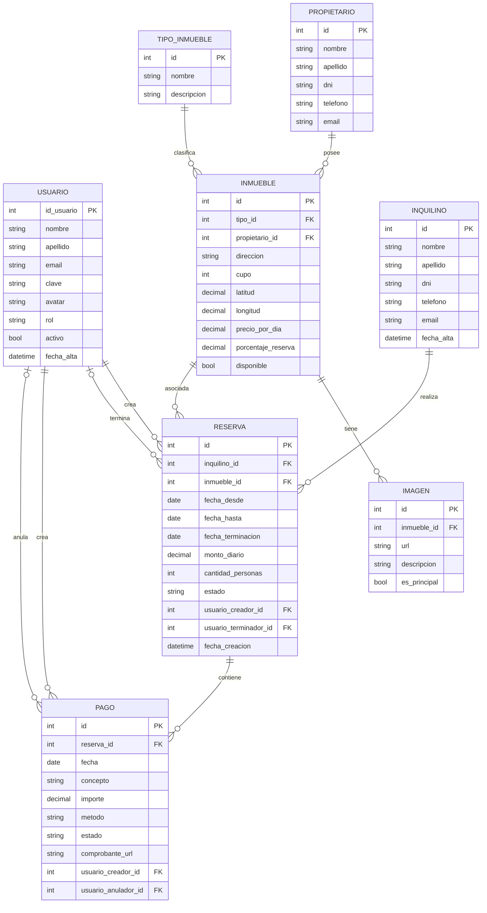

# Reservas Temporales - Inmobiliaria

> Sistema de gestion de alquileres temporarios para una agencia inmobiliaria.
> Aplicacion web desarrollada en ASP.NET Core MVC con Entity Framework Core y PostgreSQL.

---

## Indice

1. [Integrantes del Grupo](#integrantes-del-grupo)
2. [Descripcion del Proyecto](#descripcion-del-proyecto)
3. [Tecnologias Utilizadas](#tecnologias-utilizadas)
4. [Estructura del Repositorio](#estructura-del-repositorio)
5. [Funcionalidades Implementadas](#funcionalidades-implementadas)
6. [Modelo de Datos](#modelo-de-datos)
7. [Requisitos Previos](#requisitos-previos)
8. [Configuracion de la Base de Datos](#configuracion-de-la-base-de-datos)
9. [Configuracion del Proyecto](#configuracion-del-proyecto)
10. [Ejecucion del Proyecto](#ejecucion-del-proyecto)
11. [Roles y Permisos](#roles-y-permisos)
12. [Reglas de Negocio](#reglas-de-negocio)
13. [Notas Adicionales](#notas-adicionales)
14. [Licencia](#licencia)

---

## Integrantes del Grupo

- **Aldo Nehuen Zerda** - *aldonehuen123@gmail.com* - [@NehuenZ12](https://github.com/nehuenZ12)
- **Heber Gomez** - *heber12398@gmail.com* - [@owengmz](https://github.com/owengmz)
- **Jose Gabriel Garces Brocal** - *jjoosseegg69@gmail.com* - [@josegarcesss](https://github.com/josegarcesss)

---

## Descripcion del Proyecto

**Reservas Temporales** es un sistema web que informatiza la gestion de alquileres temporarios de propiedades inmuebles que realiza una agencia inmobiliaria. Permite administrar propietarios, inquilinos, inmuebles, reservas y pagos, con un sistema de autenticacion basado en roles (Administrador y Empleado).

### Entidades principales

- **Propietario**: dueno de uno o varios inmuebles.
- **Inquilino**: persona que reserva el alquiler de un inmueble.
- **Inmueble**: propiedad ofrecida en alquiler, con imagenes, coordenadas (latitud/longitud) y precio por dia.
- **TipoInmueble**: clasificacion de inmuebles (casa, departamento, monoambiente, etc.).
- **Imagen**: imagenes asociadas a un inmueble, con marca de imagen principal.
- **Reserva**: vinculo entre un inquilino, un inmueble y un rango de fechas, con estado y auditoria de creacion/terminacion.
- **Pago**: transacciones economicas asociadas a una reserva (con concepto, metodo, estado y auditoria de creacion/anulacion).
- **Usuario**: persona que accede al sistema con email y contrasena, con rol y estado activo/inactivo.

---

## Tecnologias Utilizadas

| Tecnologia                            | Version / Uso                 |
| ------------------------------------- | ----------------------------- |
| .NET                                  | 10.0                          |
| ASP.NET Core MVC                      | Framework web                 |
| Entity Framework Core                 | Acceso a datos (AppDbContext) |
| Npgsql.EntityFrameworkCore.PostgreSQL | Proveedor de PostgreSQL       |
| PostgreSQL                            | 14 o superior                 |
| Cookie Authentication                 | Autenticacion con roles       |
| Bootstrap                             | Estilos y componentes UI      |

---

## Estructura del Repositorio

```text
Inmobiliaria-Z12/
├── inmobiliaria.sql
├── Diagrama.jpeg / Diagrama2.png
├── README.md
└── mvc/
    ├── Controllers/
    │   ├── HomeController.cs
    │   ├── InmuebleController.cs
    │   ├── InquilinoController.cs
    │   ├── PagosController.cs
    │   ├── PropietarioController.cs
    │   ├── ReservaController.cs
    │   ├── TipoInmuebleController.cs
    │   └── UsuariosController.cs
    ├── Models/
    │   ├── AppDbContext.cs
    │   ├── Propietario.cs
    │   ├── Inquilino.cs
    │   ├── Inmueble.cs
    │   ├── TipoInmueble.cs
    │   ├── Imagen.cs
    │   ├── Reserva.cs / EstadoReserva.cs
    │   ├── Pago.cs / EstadoPago.cs / MetodoPago.cs
    │   ├── Usuario.cs
    │   ├── LoginViewModel.cs / EditarConceptoPagoViewModel.cs / ErrorViewModel.cs
    │   └── ViewModels/InmuebleReservaViewModel.cs
    ├── Views/
    │   ├── Home/ Inmueble/ Inquilino/ Pagos/ Propietario/ Reserva/ TipoInmueble/ Usuarios/
    │   └── Shared/
    ├── Properties/
    ├── wwwroot/
    ├── appsettings.json
    ├── Program.cs
    └── mvc.csproj
```

---

## Funcionalidades Implementadas

### ABM (Alta, Baja, Modificacion) completos

- **Propietarios** - listado con paginacion en servidor, alta, edicion y baja (solo Administrador).
- **Inquilinos** - listado con paginacion en servidor, alta, edicion y baja.
- **Tipos de inmueble** - alta, edicion y baja (solo Administrador).
- **Inmuebles** - alta y edicion con tipo, ubicacion (latitud/longitud), precio por dia y porcentaje de reserva; baja logica (solo Administrador).
- **Reservas** - alta con validacion de solapamiento de fechas, check-in, cancelacion anticipada con calculo de multa, y renovacion.
- **Pagos** - alta por reserva, filtro por concepto/estado, edicion de concepto y anulacion (solo Administrador).
- **Usuarios** - login, logout, perfil (con avatar), y gestion completa por administradores (alta, activar/desactivar, eliminar).

### Informes

- **Inmuebles mas reservados** (`InmuebleController.MasReservados`).
- **Inmuebles sin reservas** (`InmuebleController.SinReservas`).
- **Reservas vigentes** (`ReservaController.Vigentes`): reservas con estado Confirmada y fecha hasta aun no vencida.
- **Reservas que terminan en X dias** (`ReservaController.TerminanEn`, parametro `dias`, default 30).
- **Busqueda de inmuebles libres entre dos fechas** (`ReservaController.InmueblesLibres`): filtra por disponibilidad y ausencia de solapamiento con reservas activas.

### Otras funcionalidades

- **Autenticacion con cookies** y roles (`Administrador` / `Empleado`), login en `/Usuarios/Login`.
- **Paginacion en servidor** (Skip/Take) en los listados de Propietarios, Inquilinos, Inmuebles y Reservas.
- **Check-in manual**: mueve una reserva de estado `Pendiente` a `Confirmada` mediante una accion explicita, no automatico por fecha.
- **Auditoria oculta para el rol Empleado**: en la vista de Detalles de Reserva, el bloque de auditoria (usuario creador/terminador) solo se muestra si el usuario logueado tiene rol Administrador.
- **Subida de imagenes** de inmuebles con marca de imagen principal.

---

## Modelo de Datos

### Diagrama Entidad-Relacion (DER)





### Enumerados

| Enum            | Valores                                                |
| --------------- | ------------------------------------------------------ |
| `EstadoReserva` | Pendiente, Confirmada, Cancelada, Completada, Expirada |
| `EstadoPago`    | Pendiente, Pagado, Anulado, Rechazado                  |
| `MetodoPago`    | Efectivo, Transferencia, Tarjeta, MercadoPago          |

Los tres enums se persisten como texto en la base de datos (`.HasConversion<string>()`), no como enteros.

---

## Requisitos Previos

- **.NET SDK** 10.0 o superior
- **PostgreSQL** 14 o superior
- **DBeaver** o **pgAdmin** (opcional, recomendado para administrar la base de datos)
- **Visual Studio 2022** o **Visual Studio Code**

---

## Configuracion de la Base de Datos

1. **Clonar el repositorio:**

   ```bash
   git clone https://github.com/NehuenZ12/Inmobiliaria-Z12.git
   cd Inmobiliaria-Z12
   ```

2. **Crear la base de datos:**

   Conectarse al servidor PostgreSQL local (`localhost:5432`) y crear la base:

   ```sql
   CREATE DATABASE inmobiliaria;
   ```

3. **Ejecutar el script SQL:**
   - Abrir un SQL Editor conectado a la base `inmobiliaria`.
   - Abrir el archivo `inmobiliaria.sql` ubicado en la raiz del repositorio.
   - Ejecutar el script completo.

   Tambien se puede ejecutar por terminal:

   ```bash
   psql -U postgres -d inmobiliaria -f inmobiliaria.sql
   ```

4. **Verificar que las tablas se hayan creado:**

   El script crea las 8 tablas del modelo (`propietario`, `tipo`, `inmueble`, `imagen`, `usuario`, `inquilino`, `reserva`, `pago`), las claves foraneas entre ellas y carga datos iniciales de prueba, incluyendo el usuario administrador.

   ```sql
   \dt public.*
   ```

   O desde DBeaver: `inmobiliaria > Schemas > public > Tables`.

---

## Configuracion del Proyecto

1. Abrir el archivo `mvc/appsettings.json`.
2. Completar la cadena de conexion con los datos de tu PostgreSQL local:

   ```json
   {
     "ConnectionStrings": {
       "DefaultConnection": "Host=localhost;Port=5432;Database=inmobiliaria;Username=postgres;Password=TU_CONTRASENA"
     },
     "Logging": {
       "LogLevel": {
         "Default": "Information",
         "Microsoft.AspNetCore": "Warning"
       }
     },
     "AllowedHosts": "*"
   }
   ```

   > Nota: el `appsettings.json` del repositorio trae `DefaultConnection` vacio a proposito; hay que completarlo localmente antes de correr el proyecto.

### Parametros a configurar

| Parametro  | Descripcion                       | Valor por defecto |
| ---------- | --------------------------------- | ----------------- |
| `Host`     | Direccion del servidor PostgreSQL | `localhost`       |
| `Port`     | Puerto de conexion                | `5432`            |
| `Database` | Nombre de la base de datos        | `inmobiliaria`    |
| `Username` | Usuario de PostgreSQL             | `postgres`        |
| `Password` | Contrasena del usuario            | _(tu contraseña)_ |

---

## Ejecucion del Proyecto

### Opcion A: Usando Visual Studio

1. Abrir la solucion en Visual Studio.
2. Compilar con `Ctrl + Shift + B`.
3. Ejecutar con `F5` (con depuracion) o `Ctrl + F5` (sin depuracion).

### Opcion B: Usando la linea de comandos

```bash
cd mvc
dotnet restore
dotnet run
```

Luego abrir en el navegador la URL que indique la terminal (por ejemplo `http://localhost:5295`).

### Usuario de prueba

| Email             | Contraseña | Rol           |
| ----------------- | ---------- | ------------- |
| `admin@admin.com` | admin123   | Administrador |

---

## Roles y Permisos

| Rol               | Permisos                                                                                                                                                                                                                                                 |
| ----------------- | -------------------------------------------------------------------------------------------------------------------------------------------------------------------------------------------------------------------------------------------------------- |
| **Administrador** | Acceso total: ABM de todas las entidades, gestion de usuarios (alta, activar/desactivar, eliminar), eliminacion/baja de Propietarios, Inmuebles y Tipos de inmueble, anulacion de pagos, y visualizacion del bloque de auditoria en Detalles de Reserva. |
| **Empleado**      | Acceso a los listados e informes, alta/edicion de Inquilinos, Reservas y Pagos. No puede eliminar Propietarios, Inmuebles ni Tipos de inmueble, no puede anular pagos ni gestionar usuarios, y no ve el bloque de auditoria en Detalles de Reserva.      |

---

## Reglas de Negocio

### Reservas

- **Solapamiento:** una reserva no puede crearse (ni editarse) si el inmueble ya tiene otra reserva activa (estado distinto de `Cancelada`) cuyo rango de fechas se superpone.
- **Estados:** `Pendiente` (recien creada) → `Confirmada` (tras check-in manual) → `Cancelada` (terminacion anticipada) o `Completada` (calculada solo para mostrar, no se persiste, cuando `Estado == Confirmada` y `FechaHasta` ya paso). `Expirada` esta definido pero aun sin uso.
- **Check-in:** accion manual que solo puede aplicarse sobre una reserva en estado `Pendiente`.
- **Renovacion:** solo disponible para reservas en estado `Confirmada`; crea una nueva reserva que hereda inquilino, inmueble, monto diario y cantidad de personas, comenzando en la `FechaHasta` de la original.

### Cancelacion anticipada y multa

- Se calcula el punto medio del periodo reservado (`FechaDesde` + mitad de los dias totales).
- Si la cancelacion ocurre **antes** de la mitad del periodo → multa = **50%** del monto restante.
- Si ocurre **en la mitad o despues** → multa = **25%** del monto restante.
- El monto restante se calcula como los dias que quedaban hasta `FechaHasta` multiplicados por el monto diario.
- La multa se registra automaticamente como un `Pago` con concepto "Multa por terminacion anticipada de reserva".
- La reserva pasa a estado `Cancelada` y se registra `FechaTerminacion` y `UsuarioTerminadorId`.

### Pagos

- Cada pago se asocia a una reserva, con concepto, importe, metodo (Efectivo, Transferencia, Tarjeta, MercadoPago) y estado (Pendiente, Pagado, Anulado, Rechazado).
- **Edicion:** solo se puede editar el concepto del pago.
- **Anulacion:** reservada al rol Administrador.

### Inmuebles

- Un propietario puede tener uno o varios inmuebles.
- Un inmueble tiene un tipo (`TipoInmueble`), ubicacion en latitud/longitud, precio por dia y porcentaje de reserva.
- Puede tener varias imagenes, marcando una como principal.
- La disponibilidad (`Disponible`) determina si aparece en la busqueda de inmuebles libres.

### Usuarios

- Solo administradores pueden crear, activar/desactivar y eliminar usuarios.
- Cada usuario puede editar su propio perfil (datos y avatar).
- El acceso al sistema requiere autenticacion; casi todas las acciones estan protegidas con `[Authorize]`, y las de baja/gestion sensible con `[Authorize(Roles = "Administrador")]`.

---

## Notas Adicionales

- El proyecto usa **Entity Framework Core** (`AppDbContext`) con el proveedor **Npgsql** para PostgreSQL.
- Convenciones de nomenclatura: tablas y columnas en snake_case singular en la base de datos, mapeadas a PascalCase en C#; los estados (`Estado`, `Metodo`) se persisten como string via `HasConversion<string>()`.
- Las fechas de auditoria (`fecha_alta`, `fecha_creacion`) se generan del lado de la base de datos con `DEFAULT now()`, no se asignan desde el codigo C#.
- Los listados de Propietarios, Inquilinos, Inmuebles y Reservas usan paginacion en servidor (`Skip`/`Take`).
- El target framework del proyecto es **.NET 10.0**.
- El puerto por defecto de la aplicacion puede variar segun `Properties/launchSettings.json`.
- Para desarrollo, se recomienda usar **User Secrets** o variables de entorno para no exponer la contraseña de PostgreSQL en el repositorio (el `appsettings.json` versionado trae la cadena de conexion vacia a proposito).

---

## Licencia

Este proyecto fue desarrollado con fines academicos para la materia **Laboratorio 2**.

---
